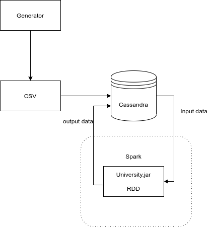

## Как запустить приложение

Установка docker образа
    
` docker pull dawidnowak/spark-cassandra`

Запуск приложения

` ./run.sh`

Перейти в папку university-attendance

` cd university-attendance`

Проверить состояние Cassandra

` nodetool status`

Должно быть

Status=Up/Down

Выполнить следующий скрипт для генерации входных данных, их сохранения в Cassandra и запуска Spark

 `./init.sh /path-to cassandra-host` 

где, ` /path-to ` - путь для сохранения промежуточных данных
где, ` cassandra-host ` - Адрес Cassandra. Можно узнать выполнив ` nodetool status`

К примеру  `./init.sh ./ 192.168.32.2 `

После завершения выполнения программы проверить результаты можно в консоли Cassandra:

` cqlsh`
` SELECT * FROM university.result; `

Завершение docker
` ./stop`

### Cхема взаимодействия компонентов

